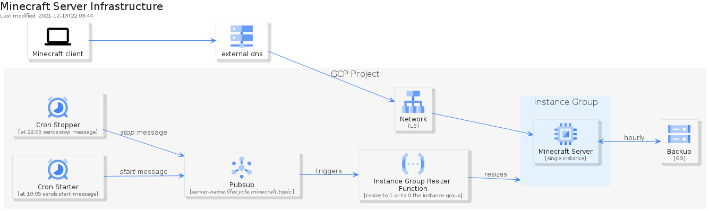

# Minecraft Server instance

Spawns a Minecraft Server

Features:

* Exposes Minecraft server and Minecraft RCON (password protected)

* Exposes Minecraft as single instance template exposed via external GCP Network Loadbalancer.

* Minecraft server starts with single whitelisted & op (aka admin) user. To allow other users to connect - op user has to join server and whitelist users via command: `/whitelist add username`

* Minecraft server world and configuration is automatically backup each hour to Cloud Storage. When server crashes - after 200 seconds of inactivity - the instance is recreated. Upon startup , the last backup is downloaded, otherwise it creates a new fresh world. Upon ordinary reboot, the backup is not downloaded.

* Attempt to logging and logout from the server are kept in separate log bucket sing for 30 days.

* Minecraft server is automatically shutdown (instanceGroup is scaled to 0) at 10:05 PM and automatically started at 10:05 AM every day.

Limitations:

* public DNS is not created, requires separated public DNS for Minecraft server LB external IP

## Architecture

<!--
TODO include png in base64 for when GitHup md renderer supports it

-->


## Prerequisites

* Terraform `../gcp-iam` has been deployed - for custom IAM roles setup

* Terraform `../gcp-network-setup` has been deployed - for networking setup

* Cloud Scheduler requires AppEngine setup in your GCP project in the same region where you intent do deploy app.

## Usage

```bash
# setup (plan or apply) or destroy Minecraft Server VM
make run [MODE=plan/apply/destroy] [ENV=prod-01] PASS=pass_for_minecraft_rcon OP_USER=minecraftusername

# ssh to Minecraft Server instance
make ssh [ENV=prod-01]

# show terraform.state
make show-state
```
